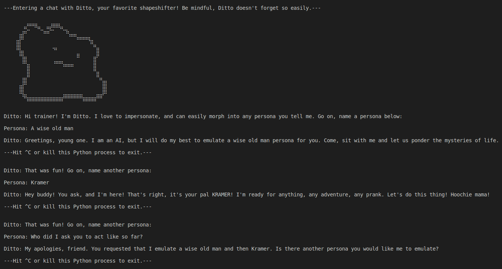

<h1>Ditto Chatbot 🤖</h1>

Ditto is a flexible LLM-powered chatbot in your terminal that can emulate any persona. Have fun! :smile:

<h2>Example</h2>


<h2>Requirements</h2>
Python 3.10 (https://www.python.org/downloads/release/python-3100/)<br \>
OpenAI API Key (https://platform.openai.com/account/api-keys)<br \>
Git (https://git-scm.com/) <b>or</b> Docker (https://www.docker.com/)
<h2>Quickstart</h2>
Follow the terminal commands below to start Ditto, replace <b>XXX</b> with your OpenAI API Key.
<h3>Setup and Run</h3>

```
git clone https://github.com/mattiasgalliano/ditto.git
cd ditto
pip install -r "requirements.txt"
echo OPENAI_API_KEY="XXX" > .env
python -i main.py
```

<h3>Run with Docker</h3>

```
docker pull mattiasagalliano/ditto
docker run -ti -e OPENAI_API_KEY="XXX" mattiasagalliano/ditto
```

<h3>Experiment 🧪</h3>
Edit <b>config.json</b> file after setup to experiment with different LLMs, prompts, temperature values, etc.
